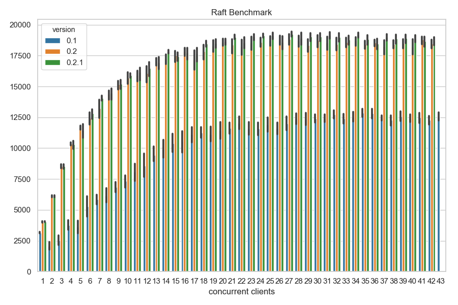
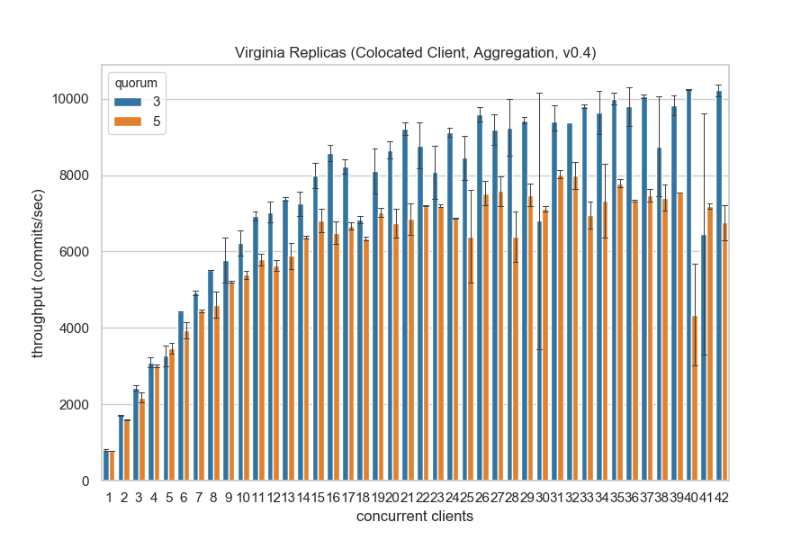

# Raft

[](https://travis-ci.com/bbengfort/raft)
[](https://godoc.org/github.com/bbengfort/raft)

**Actor based implementation of the [Raft consensus algorithm](https://raft.github.io/)**.

## Quick Start

To install this implementation of Raft on a system:

```
$ go get github.com/bbengfort/raft/...
```

This should install the `raft` command on your system. Create a configuration file that defines the peers for the network and other parameters as follows:

```json
{
  "tick": "300ms",
  "timeout": "100ms",
  "log_level": 5,
  "peers": [
    {
      "pid": 1,
      "name": "alpha",
      "ip_address": "127.0.0.1",
      "domain": "localhost",
      "port": 3264
    },
    {
      "pid": 2,
      "name": "bravo",
      "ip_address": "127.0.0.1",
      "domain": "localhost",
      "port": 3265
    },
    {
      "pid": 3,
      "name": "charlie",
      "ip_address": "127.0.0.1",
      "domain": "localhost",
      "port": 3266
    }
  ]
}
```

The configuration file can be stored as a `.toml`, `.json`, `.yml`, `.yaml` file in the following locations:

- `/etc/raft.json`
- `~/.raft.json`
- `$(pwd)/raft.json`

Or the path to the configuration file can be passed to the command at runtime. To run a raft replica process:

```
$ raft serve -n alpha
```

The `-n` command specifies which peer configures the local replica, by default if no name is specified, then the hostname of the machine is used. To commit a command to the Raft log:

```
$ raft commit -k "key" -v "value"
```

This commits the command named "key" with the specified "value" to the log. Note that the client is automatically redirected to the leader and requires the same configuration to connect.


## Benchmarks

The following benchmark is run on a MacBook Pro with 16GB RAM and an 3.1 GHz Intel Core i7 quad core processor. The cluster is composed of three Raft processes, with another process running concurrent client queries for a fixed duration.



Note that because these benchmarks are run on a single machine, there is no network latency between requests.

- Version 0.1: gRPC unary rpc
- Version 0.2: gRPC bidirectional streaming for AppendEntries
- Version 0.3: experimental design and setup (not benchmarked)
- Version 0.4: aggregate append entries from clients

The following benchmark shows the performance of the latest version of Raft on a cluster of three and five `t2.medium` instances running in a single AWS region.


