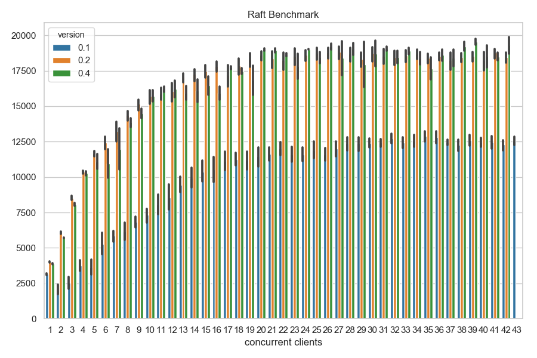

# Raft

**Actor based implementation of the [Raft consensus algorithm](https://raft.github.io/)**.

## Benchmarks

The following benchmark is run on a MacBook Pro with 16GB RAM and an 3.1 GHz Intel Core i7 quad core processor. The cluster is composed of three Raft processes, with another process running concurrent client queries for a fixed duration.

Version 0.1: gRPC unary rpc
Version 0.2: gRPC bidirectional streaming for AppendEntries
Version 0.3: experimental design and setup
Version 0.4: aggregate append entries from clients
